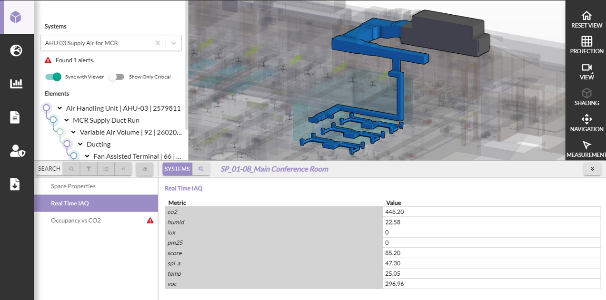
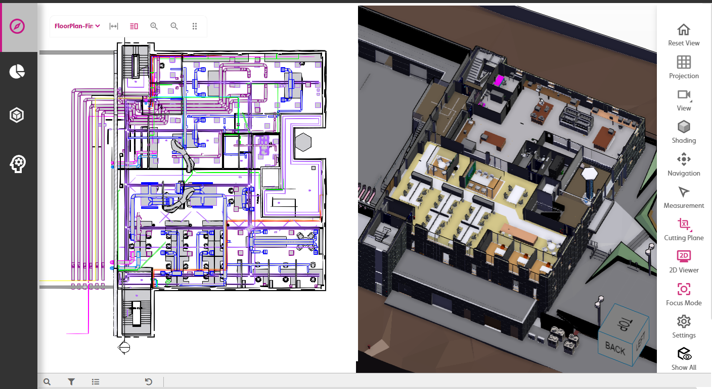
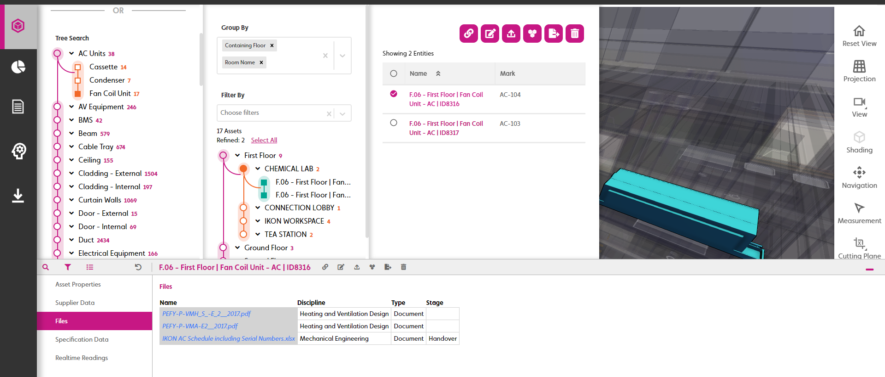
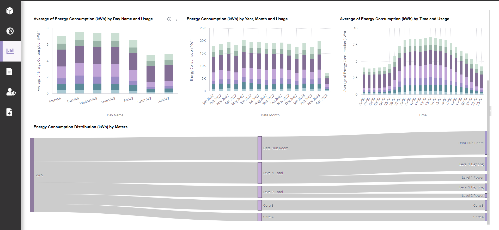

# digitaltwin-factory

[digitaltwin-factory](https://community.digitaltwin-factory.com/) is an open-source community powering development of digital twins on Twinit. Join the digitaltwin-factory community to gain access to a wealth of information and training material on how to use Twinit to accomplish your digital twin goals. Membership in digitaltwin-factory open-source community includes access to self-led development courses for building applications using Twinit, access to the developer documentation for Twinit concepts, services, and APIs, access to open-source code modules and UI libraries to help accelerate and kick-start your projects, as well as access to a community of developers who develop using Twinit. For more information visit [https://invicara.com/](https://invicara.com) and [https://twinit.com/](https://twinit.com)

[Sign up now!](https://invicara.com/open-source#opensourcecommunity)

# Twinit IPA Core React Framework (ipa-core)

This repository contains open-source code for the ipa-core React framework for use in rapidly developing React web clients for Twinit.

The ipa-core framework offers automatically routing your users through Twinit's authentication, managing your user's tokens, and displaying a dialog for your user to select the project and user group they wish to use.

It also provides an extensible user interface framework with configurable header and nav bars, which can also be hidden if you do not wish to use them.

Generic and configurable pages such as dashboards, entty views, and file upload as well as configurable controls are also included in the ipa-core library.









# Dependencies and Required Memebership in digitaltwin-factory

In order to use this framework or or install and run the code in this repository, you must be a memeber of he digitaltwin-factory open source community. This and other associated repositories rely on the use of the Twinit javascript libraries that are only available to dgitaltwin-factory members.

# Using the Framework

To use the ipa-core framework you don't need this repository. Instead, you can simply use the [create-twinit-app](https://github.com/Invicara/create-twinit-app) npx command to quickly bootstrap a new React client.

# Installing ipa-core

ipa-core can be installed using npm. If you are not a member of the digitaltwin-factory Twinit dependencies will fail to install.

```
npm install ipa-core
```

# Building ipa-core Locally

You can build the fraemwrok locally by running:

```
npm run build-dev
```

# Submitting a Pull Request

Coming Soon