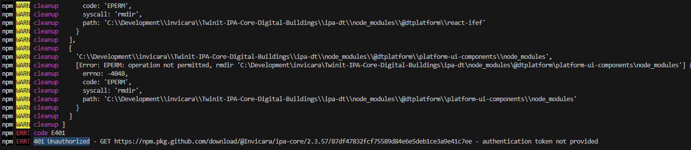
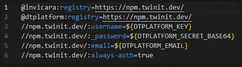
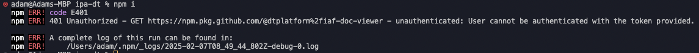
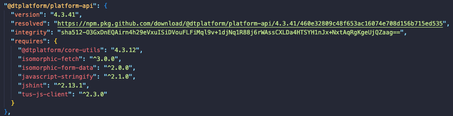
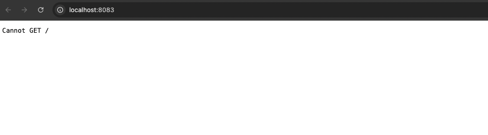
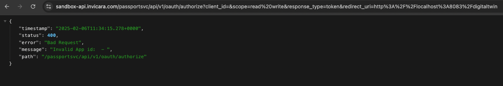
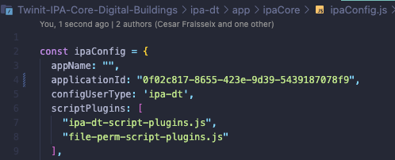
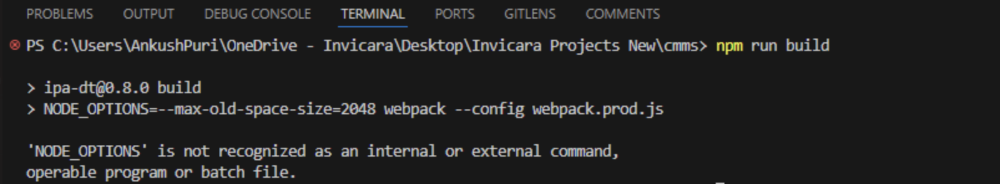
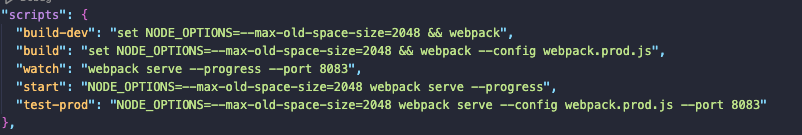
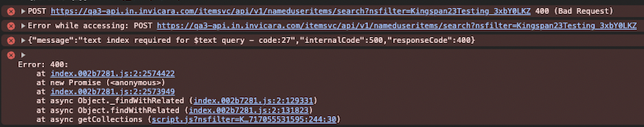

## Authentication token errors

When trying to install any of the Twinit libraries, you may encounter this error or an error similar to it, in your terminal. This could be caused by a number of factors. 

#### Generating the Access and Secret keys
It is important to note that it is a common mistake to use your Sandbox user account to generate your access keys. Sandbox credentials cannot be used to install Twinit npm libraries and will result in an error. The correct place to generate these keys is linked here: https://api.invicara.com/passportsvc/api/. 
A guide on how to generate these keys can be found here: [twinit.dev](https://twinit.dev/docs/apis/rest/authentication/user-access-keys)

#### Setting your .npmrc file
 The `.npmrc` file should be located in the same folder as your `package.json` file. Your `.npmrc` file should be configured as shown in the example below.

Check that your DTPLATFORM environment variables are set correctly. If your DTPLATFORM environment variables are not set correctly, you may encounter the error shown in the image below. Instructions on how to set your environment variables, which vary by operating system, can be found on [twinit.dev](https://twinit.dev/docs/apis/javascript/npm-install/). 

#### Checking Twinit package path

If you have ensured that your `.npmrc` file is correct and located in the same folder as your `package.json` file, and that your environment variables have been correctly configured based on your Twinit production user account, the error may exist in your package-lock.json file. Since npm will not override a repository specified in the `package-lock.json` file, it's possible that if a `package-lock.json` was provided to you, that it may have references to the wrong npm repository for the Twinit libraries.

Frequently this will appear as an error stating that you do not have access to install a package from https://npm.pkg.github.com/@invicara.

To check if this is the case, open your package-lock.json file. Once opened, search for a Twinit npm library such as @dtplatform/platform-api or the library that appears in your error message. If the resolved path starts with anything other than https://npm.twinit.dev/ (such as shown in the above image), then the problem is your `package-lock.json` file. You can resolve this by deleting your `package-lock.json` file and running npm install again.

:::note
The solutions above for authentication token errors are expanded upon in the following link: [community.digitaltwin-factory](https://community.digitaltwin-factory.com/knowledgebase-5wzpkylt/post/authentication-errors-installing-twinit-npm-libraries-ySEzOpPtA3uKVfw)
:::

## Cannot GET /

When trying to connect to the DigitalTwin app via localhost, you may encounter into the above error. Please ensure you use the correct URL address, which is: http://localhost:8083/digitaltwin/.

## Invalid App ID

The error attached above occurs when a user tries to connect to the DigitalTwin App but has not yet provided the app with an Application ID . This can be set inside the `ipa-dt/app/ipaCore/ipaConfig.js`. You need to place your app's ID into the `applicationId` key, as shown in the example below.

## NODE_OPTIONS not recognized

The above error can occur when a user is using a Windows-operated machine while trying to run the `npm run build` or `npm run build-dev` commands. Inside the `package.json` file, you must update these scripts and add `set` and `&&`, so they will appear as shown in the image below.

## Text index required

On newly created projects, it is common to encounter the error shown in the above image when trying to use the Quick Search text input feature while searching for Assets, Spaces , or Collections. To resolve this, you can run the following scripts found in the Project's `projectSetup.js` file, which is accessible via the Twinit VsCode extension.

|Entity|Script Name|
|---|---|
|Assets| `createOrRecreateAssetIndex`|
|Spaces| `createOrRecreateSpacesIndex`|
|Collecitons| `createOrRecreateCollectionsCollection`|