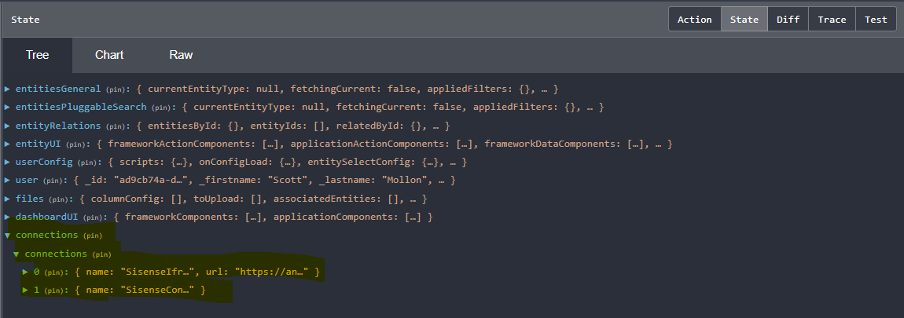
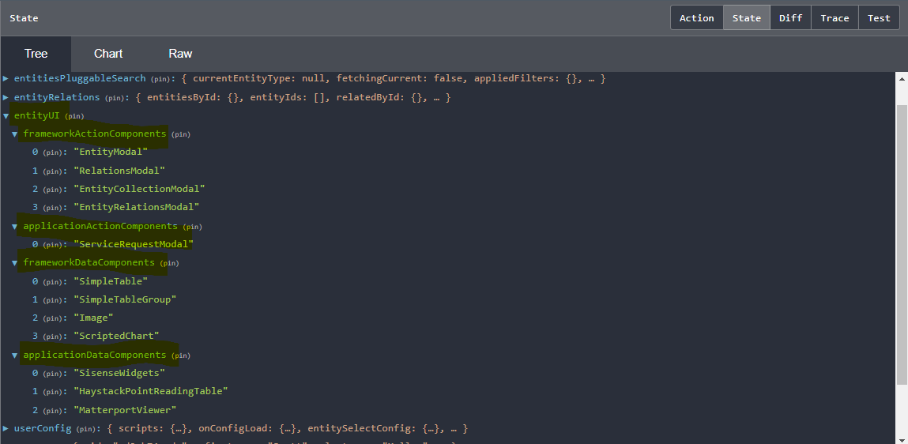

The Twinit.io UI framework requires two types of configuration:
`endPointConfig` and `ipaConfig`. These configurations can be combined
or managed separately.

## endPointConfig

A configuration for the platform service endpoints must be provided to
the framework. Endpoint paths must be provided for any services you want
to use on the platform.

### config.js

```jsx
const endPointConfig = {
  itemServiceOrigin: 'https://dt-dev.invicara.com',
  passportServiceOrigin: 'https://dt-dev.invicara.com',
  fileServiceOrigin: 'https://dt-dev.invicara.com',
  datasourceServiceOrigin: 'https://dt-dev.invicara.com',
  graphicsServiceOrigin: 'https://dt-dev.invicara.com',
  pluginBaseUrl: 'http://dt-dev.invicara.com/downloads/IPAPlugins/',
  baseRoot: 'http://localhost:8083/digitaltwin'
};
```

This configuration must be loaded and provided globally by your application.

### index.html

```jsx
<head>
    <meta http-equiv="Content-Type" content="text/html; charset=utf-8" />
    <meta http-equiv="X-UA-Compatible" content="IE=edge">
    <meta name="viewport" content="width=device-width, initial-scale=1, maximum-scale=1, user-scalable=no" />
    <meta name="description" content="My Platform Application" />
    <title>My Platform Application</title>
</head>

<body>
  <script type="application/javascript" src="/digitaltwin/config.js"></script>
  <div id="app"></div>
</body>
```

## ipaConfig

The `ipaConfig` configuration specifies

- Redux slices that you want to use to extend state management
- Additional controls and components with which you want to extend the EntityView or DashboardView.

The ipaConfig must contain:

- Your applications names
- The user `configUserType` for your application
- The location of any Redux slices you want to add
- The location and types of any components you want to make available to framework-provided pages

You may also specify:

- CSS files to load after all other framework css has been loaded allowing for style customizations

The css files must be in the ipaCore/css folder.

All Redux slices and components will be loaded from `app/ipaCore` folder.

- Redux slice files must exist in the `app/ipaCore/redux` folder
- Component files must exist in the `app/ipaCore/components` folder

```jsx
const ipaConfig = {
  appName: "My Platform Application",
  configUserType: 'my-ipa',
  css: ['myTheme.css'],
  redux: {
    slices: [
      {name: 'connections', file: 'connections.js'}
    ]
  },
  components: {
    dashboard: [
      {name: "SisenseWidgets", file: "SisenseWidgets.jsx"},
      {name: "SisenseIframe", file: "SisenseIframe.jsx"},
      {name: "PropertyInfoTable", file: "PropertyInfoTable.jsx"},
      {name: "MatterportViewer", file: "MatterportViewer.jsx"},
    ],
    entityData: [
      {name: "SisenseWidgets", file: "SisenseWidgets.jsx"},
      {name: "HaystackPointReadingTable", file: "HaystackPointReadingTable.jsx"},
      {name: "MatterportViewer", file: "MatterportViewer.jsx"}
    ],
    entityAction: [
      {name: "ServiceRequestModal", file: "ServiceRequestModal.jsx"}
    ]
  }
}

export default ipaConfig
```

## The Types of Components

Three types of components are currently supported to extend the
framework provided pages.

1. `dashboard` components - Dashboard components can be used and displayed on the `DashboardView` and configured through the user configuration for the `DashboardView` page
2. `entityData` components - Entity data components can be used and displayed in the `EntityDataStack` in the `EntityView` page
3. `entityAction` components - Entity action components can be used to add new types of actions configured in the action\'s configuration for the `EntityView` page. Entity action components must export a factory method that is `<the components' name>` + `Factory`. This method should return the component.

## Check that the Redux Slices and Components are Loaded

You can check if your slices and components are correctly loaded by the framework using the Redux tools in your browser.

The Redux state should show any slices you added.



It should also show slices for` dashboardUI` and `entityUI`



