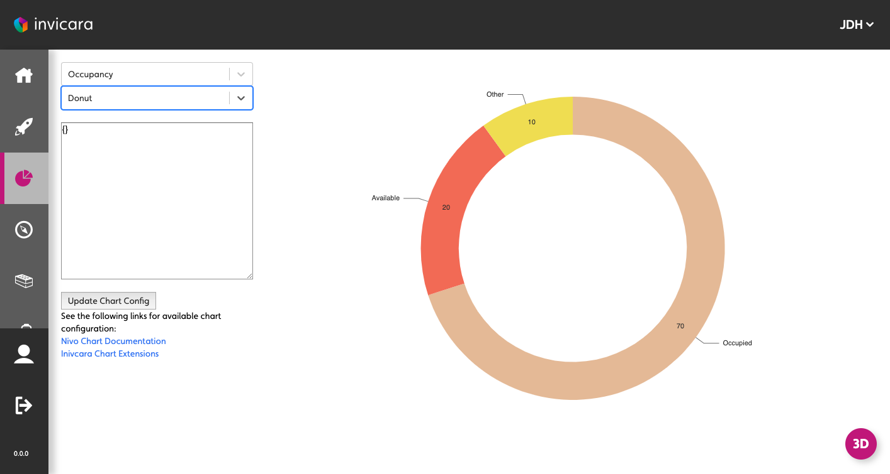
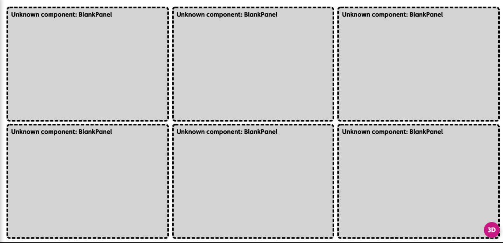

|Name|Description|
|---|---|
|[`pageComponent`](#pageComponent)|Activates the Dashboard View.|
|[`layout`](#layout)|Specifies the dimensions of the grid.|
|[`component`](#component)|Used with a `fullpage` layout to specify the single component that renders the view.|
|[`panels`](#panels)|Used with a `grid` layout to specify the content and position of the panels that make up the view.|
|[`preloadImages`](#preloadImages)|Used to load images more quickly that may be displayed on the dashboard.|
|[`headerInfo`](#headerInfo)|Used to load images more quickly that may be displayed on the dashboard.|

---

## `pageComponent`

Use `'pageComponent: ‘dashboard'/DashboardView’` in a handler to activate the Dashboard View.

This view is designed to allow the configuration author a certain amount of control over the layout of the page as well as the page content (compare with the Entity View that allows configuration of the content but not the layout).

The config section of the Dashboard handler has two main sections the layout and the components (the components provide the content).

There are two layout modes available:

- `fullpage` - the simplest config to allow whatever component is chosen to simply fill the entire page.
- `grid` - the page is split into the specified number of rows and columns to give a set of “grid slots” of equal size. Each component on the page is contained within a `panel` and the `panel` can be configured to span a group of gird slots (by providing a top, left, bottom, and right set of column/row numbers). This is based on one of the common CSS `display: grid` usage patterns.

---

## `config`

### `layout`

Specifies the dimensions of the grid.

```jsx
layout: {
  mode: 'grid',
  className: 'homepage'
  rows: 4,
  columns: 3,
}
```

#### Configuration

- `mode`: either `fullpage` or `grid`
- `className`: (optional) a CSS class name applied to the page
- `rows`: required for `grid` - the number of rows
- `columns`: required for `grid`- the number of columns

### `component`

Used with a `fullpage` layout to specify the single component that renders the view.

```jsx
config: {
  layout: { mode: 'fullpage' }
  component: 'ChartTestPage'
}
```

### `panels`

Used with a `grid` layout to specify the content and position of the panels that make up the view.

```jsx
config: {
  layout: {
    mode: 'grid',
    rows: 4,
    columns: 3
  },
  panels: {
    myfirstpanel: { 
      reactor: true,
      component: "AComponent"
      // component configuration
    },
    asecondpanel: { 
      position: {top: 1, left: 1, bottom: 4, right: 3},
      reactee: true,
      component: "AnotherComponent",
      // component configuration
    }
  }
}
```

#### Configuration

- `key`: A name for this panel
- `position`: The position of the panel specified using “grid line numbers” with the topmost line being 1 and the leftmost line being 1. The rightmost line will be the number of columns plus 1, and the bottommost will be the number of rows plus 1.
- `component`: The component used to render the contents of the panel.
- `component configuration`: This is dependent on whichever component is chosen (see above)
- `reactor`: (optional) true/false, whether or not the panel will be handed an `onClick` handler to pass data back up to the DashboardView, which will then be handed down to any panels marked as `reactee`s.
- `reactee`: (optional) true/false, whether or not the panel will be handed a reactInfo passed down from the DashboardView.

#### Notes

If no position is provided the grid is filled from the top left one grid slot at a time in a left-to-right order.

### `preloadImages`

Used to load images more quickly that may be displayed on the dashboard.

```jsx
preloadImages: [
   "ikon-spaces-chem-lab.jpg",
   "ikon-spaces-ikon-workspace.jpg",
   "ikon-spaces-entrance.jpg"
],
```

#### Configuration

An array of file names to load.

### headerInfo

Used to display a dashboard title and optionally a navigation button at the top of a dashboard.

```jsx
headerInfo: {
   title: "Analytics | Comfort & Wellness | Temperature",
   navButton: {
      title: "View System",
      action: {
         type: "navigate",
         navigateTo: "diagnostics"
      }
   }
},
```

#### Configuration

- `title`: the title of the dashboard
- `navButton`: (optional) the config for the navigation button
- `navButton.title`: the title to display in the button
- `navButton.action`: the `navigateTo` action

---

## Examples

### Fullpage

```jsx
handlers: {
    charts: {
      title: "Chart Tests",
      icon: "icofont-pie-chart",
      shortName: 'chart-test',
      description: 'Chart Tests',
      pageComponent: 'dashboards/DashboardView',
      path: '/charts',
      config: {
        layout: 'fullpage',  
        component: 'ChartTestPage'
      }
    }
  }
```



### Simple Grid of Panels

```jsx
handlers: {
    dashboard: {
      title: "Mission Control",
      icon: "icofont-rocket",
      shortName: 'dashboard',
      description: 'Sample Dashboard',
      pageComponent: 'dashboards/DashboardView',
      path: '/dashboard',
      config: {
        layout: 'grid', // <-- using a grid
        rows: 2,
        columns: 3,
        panels: {
          panel1: { component: "BlankPanel" }, // <-- no positioning just defaults to one cell per component
          panel2: { component: "BlankPanel" },
          panel3: { component: "BlankPanel" },
          panel4: { component: "BlankPanel" },
          panel5: { component: "BlankPanel" },
          panel6: { component: "BlankPanel" }
        }
      }
    }
}
```



### A Homepage style Dashboard

```jsx
handlers: {
  homepage: {
    title: "Homepage",
    icon: "icofont-home",
    shortName: 'homepage',
    description: 'Home',
    pageComponent: 'dashboards/DashboardView',
    path: '/homepage',
    config: {
      layout: 'grid', // <-- use a grid
      className: 'homepage',
      rows: 4, // <-- of this size
      columns: 3,
      panels: {
        properties: {
          position: {top: 1, left: 1, bottom: 4, right: 3}, // <-- position the component on the grid
          component: "PropertyCarousel",
          script: "getProperties"
        },
        charts: {
          position: {top: 1, left: 3, bottom: 4, right: 4},
          component: "ChartStack",
          charts: [
            {
              chart: "Donut",
              script: "getOccupancy",
              colors: [],
              title: "Space",
              centerItem: "Occupied"
            },{
              chart: "Bar",
              script: "getCapExForecast",
              colors: [],
              title: "Capital Expenditure Forecast"
            }
          ]
        },
        buttons: {
          position: {top: 4, left: 1, bottom: 5, right: 4},
          component: "BigButtonBar",
          actions: {
            Navigator: {
              allow: true,
              icon: 'nav-svg',
              type: 'navigate',
              navigateTo: 'navigator',
              title: 'Navigator',
              text: 'Explore the building model and related data'
            },
            Assets: {
              allow: true,
              icon: 'asset-svg',
              type: 'navigate',
              navigateTo: 'entities',
              title: 'Assets',
              text: 'Detailed asset data for operations and capital planning'
            },
            Spaces: {
              allow: true,
              icon: 'spaces-svg',
              type: 'navigate',
              navigateTo: 'spaces',
              title: 'Spaces',
              text: 'Spatial configuration and related data'
            },
            Files: {
              allow: true,
              icon: 'files-svg',
              type: 'navigate',
              navigateTo: 'docs',
              title: 'Files',
              text: 'All property files for operations, property management, etc.'
            }
          }
        }
      }
    }
  }
}
```
