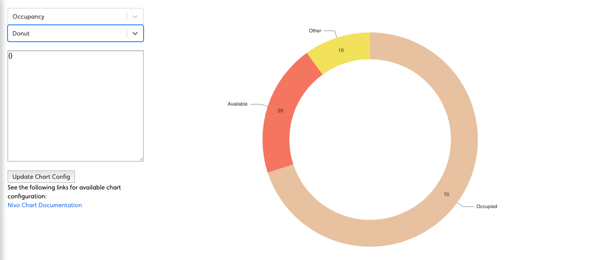

|Name|Description|
|---|---|
|[`pageComponent`](#pageComponent)|Activates the Dashboard View.|
|[`layout`](#layout)|Specifies the dimensions of the grid.|
|[`component`](#component)|Used with a `fullpage` layout to specify the single component that renders the view.|
|[`panels`](#panels)|Used with a `grid` layout to specify the content and position of the panels that make up the view.|
|[`preloadImages`](#preloadImages)|Used to load images more quickly that may be displayed on the dashboard.|
|[`headerInfo`](#headerInfo)|Used to load images more quickly that may be displayed on the dashboard.|

---

## `pageComponent`

Use `'pageComponent: ‘dashboard'/DashboardView’` in a handler to activate the Dashboard View.

This view is designed to allow the configuration author a certain amount of control over the layout of the page as well as the page content (compare with the Entity View that allows configuration of the content but not the layout).

The config section of the Dashboard handler has two main sections the layout and the components (the components provide the content).

There are two layout modes available:

- `fullpage` - the simplest config to allow whatever component is chosen to simply fill the entire page.
- `grid` - the page is split into the specified number of rows and columns to give a set of “grid slots” of equal size. Each component on the page is contained within a `panel` and the `panel` can be configured to span a group of gird slots (by providing a top, left, bottom, and right set of column/row numbers). This is based on one of the common CSS `display: grid` usage patterns.

---

## `config`

### `layout`

Specifies the dimensions of the grid.

```jsx
layout: {
  mode: 'grid',
  className: 'homepage'
  rows: 4,
  columns: 3,
}
```

#### Configuration

- `mode`: either `fullpage` or `grid`
- `className`: (optional) a CSS class name applied to the page
- `rows`: required for `grid` - the number of rows
- `columns`: required for `grid`- the number of columns

### `component`

Used with a `fullpage` layout to specify the single component that renders the view.

```jsx
config: {
  layout: { mode: 'fullpage' }
  component: 'ChartTestPage'
}
```

### `panels`

Used with a `grid` layout to specify the content and position of the panels that make up the view.

```jsx
config: {
  layout: {
    mode: 'grid',
    rows: 4,
    columns: 3
  },
  panels: {
    myfirstpanel: { 
      reactor: true,
      component: "AComponent"
      // component configuration
    },
    asecondpanel: { 
      position: {top: 1, left: 1, bottom: 4, right: 3},
      reactee: true,
      component: "AnotherComponent",
      // component configuration
    }
  }
}
```

#### Configuration
|Name|Description|
|---|---|
|`key`| A name for this panel|
|`position`| The position of the panel specified using “grid line numbers” with the topmost line being 1 and the leftmost line being 1. The rightmost line will be the number of columns plus 1, and the bottommost will be the number of rows plus 1|
|`component`| The component used to render the contents of the panel|
|`component configuration`| This is dependent on whichever component is chosen (see above)|
|`reactor` (optional)|  whether or not the panel will be handed an `onClick` handler to pass data back up to the DashboardView, which will then be handed down to any panels marked as `reactee`s. Boolean|
|`reactee` (optional)| Whether or not the panel will be handed a reactInfo passed down from the DashboardView. Boolean|

:::note
If no position is provided the grid is filled from the top left one grid slot at a time in a left-to-right order.
:::

### `preloadImages`

Used to load images more quickly that may be displayed on the dashboard.

```jsx
preloadImages: [
   "ikon-spaces-chem-lab.jpg",
   "ikon-spaces-ikon-workspace.jpg",
   "ikon-spaces-entrance.jpg"
],
```

#### Configuration

An array of file names to load.

### headerInfo

Used to display a dashboard title and optionally a navigation button at the top of a dashboard.

```jsx
headerInfo: {
   title: "Analytics | Comfort & Wellness | Temperature",
   navButton: {
      title: "View System",
      action: {
         type: "navigate",
         navigateTo: "diagnostics"
      }
   }
},
```

#### Configuration

|Name|Description|
|---|---|
|`title`| The title of the dashboard|
|`navButton` (optional)| The config for the navigation button|
|`navButton.title`| The title to display in the button|
|`navButton.action`| The `navigateTo` action|

---
### Supported Components
Please find a list below of all the pre-existing components that can be easily loaded into the Dashboard via the userConfig JSON file. Each of these JSON objects should be placed inside the config of the dashboard object found in the 'handlers'. A full example of a setup will be found at the bottom of this page.

#### ChartTestPage
Designed to be a fullpage view for selecting scripts, displaying a chart and allowing dynamic configuration.
##### Example:
```jsx
"handlers": {
  "charts": {
    "title": "Chart Tests",
    "icon": "icofont-pie-chart",
    "shortName": 'chart-test',
    "description": 'Chart Tests',
    "pageComponent": 'dashboards/DashboardView',
    "path": '/charts',
    "config": {
      "layout": 'fullpage',  
      "component": 'ChartTestPage'
    }
  }
}
```
#### ChartStack
A vertical stack of an equally spaced number of scripted charts. 
##### Example:
```jsx
"charts": {
  "position": {top: 1, left: 3, bottom: 4, right: 4},
  "component": "ChartStack",
  "charts": [
    {
      "chart": "Donut",
      "script": "getOccupancy",
      "colors": [],
      "title": "Space",
      "centerItem": "Occupied"
    },{
      "chart": "Bar",
      "script": "getCapExForecast",
      "colors": [],
      "title": "Capital Expenditure Forecast"
    }
  ]
},
```
#### BigButtonBar
A horizontally aligned array of navigation buttons.
##### Example:
```jsx
"buttons": {
  "position": {"top": 4, "left": 1, "bottom": 5, "right": 4},
  "component": "BigButtonBar",
  "actions": {
    "Navigator": {
      "allow": true,
      "icon": "nav-svg",
      "type": "navigate",
      "navigateTo": "navigator",
      "title": "Navigator",
      "text": "Explore the building model and related data"
    },
    "Assets": {
      "allow": true,
      "icon": "asset-svg",
      "type": "navigate",
      "navigateTo": "entities",
      "title": "Assets",
      "text": "Detailed asset data for operations and capital planning"
    }
  }
}
```
#### CompactButtonBar
A button bar, with the buttons clearly defined. We can use the same configuration as the one used for the BigButtonBar.
##### Example
```jsx
 "buttons": {
    "position": {
      "top": 3,
      "left": 1,
      "bottom": 4,
      "right": 4
    },
    "component": "CompactButtonBar",
    "actions": {
      "Navigator": {
        "allow": true,
        "icon": "simple_navigator.png",
        "type": "navigate",
        "navigateTo": "navigator",
        "title": "Navigator",
        "text": "Explore the building model and related data"
      },
      "Assets": {
        "allow": true,
        "icon": "simple_assets.png",
        "type": "navigate",
        "navigateTo": "assets",
        "title": "Assets",
        "text": "Detailed asset data for operations and capital planning"
      }
    }
  }
```
The following is a list of the current button images that can be used in the "icon" property:
- assets.png
- simple_assets.png
- navigator.png
- simple_navigator.png
- simple_buildingPerformance.png
- simple_comfortWellness.png
- docs.png
- simple_files.png
- simple_smartBuilding.png
- spaces.png
- simple_spaces.png

#### Image
Displays an image. Configuration must include a url, filename or script. If a url is configured it will be used. If there is no url provided, it will use the filename. If there is no filename provided, then the script will be used.

|Configuration|Description|
|---|---|
|url (optional)|The url to the image|
|filename (optional)|The filename of an image uploaded to the project|
|script (optional)|A script which returns a fileId to the image file|
|styles (optional)|css styles to apply to the image|
|navigateTo (optional)|The name of handler to navigate to when the image is clicked|
|query (optional)|queryParams and/or selectedEntity info for the navigateTo action|

##### Example:
```jsx
"digiImage": {
    "position": {
      "top": 1,
      "left": 3,
      "bottom": 2,
      "right": 4
    },
    "component": "Image",
    "filename": "Kingspan_IKON_Aerial_Image.jpg",
    "styles": {
      "width": "80%",
      "borderRadius": "25px"
    },
    "navigateTo": "spaces"
  },
```
#### CrossEntitySearch
Displays a search bar with an embedded table to search for any entities throughout the whole app from a text field. Entity can later be navigated to from the table.
|Configuration|Description|
|---|---|
|component|The ‘CrossEntitySearch’ component name|
|searchableEntities|The entity types to be searched among|
|searchableEntities.entityType|The corresponding Entity Type object, specifying singular and plural|
|searchableEntities.handler|The handler indicating where to navigate upon user clicking on entity name in search results|
|searchableEntities.default|Flag indicating whether the entity should be checked for search by default|
|script|The name of the script to perform the search|

##### Example:
```jsx
  "crossEntity": {
    "position": {
      "top": 1,
      "left": 1,
      "bottom": 4,
      "right": 3
    },
    "component": "CrossEntitySearch",
    "searchableEntities": [
      {
        "entityType": {
          "plural": "Assets",
          "singular": "Asset"
        },
        "handler": "entities",
        "default": true
      },
      {
        "entityType": {
          "plural": "Spaces",
          "singular": "Space"
        },
        "handler": "spaces",
        "default": true
      },
      {
        "entityType": {
          "plural": "Files",
          "singular": "File"
        },
        "handler": "files",
        "default": false
      },
      {
        "entityType": {
          "plural": "Collections",
          "singular": "Collection"
        },
        "handler": "collections",
        "default": false
      }
    ],
    "script": "crossEntitySearch"
  }
```

#### Iframe
Displays an iframe on the dashboard
|Configuration|Description|
|---|---|
|url|the url for the iframe|
|width (optional)|width in pixels of the viewer|
|height (optional)|height in pixels of the viewer|
|allowFullScreen (optional)|whether to allow the user to go fullscreen|

##### Example:
```jsx
"matterport": {
   "position": {top: 1, left: 2, bottom: 2, right: 3},
   "component": "GenericIframe",
   "url": "https://my.matterport.com/show/?m=CA9stBspvL2",
   "height": 600,
},
```

#### ScriptedAlertTable
Displays a table with a list of current alarms that are active on a System. The user has the ability to Acknowledge the alarm and also to navigate directly to the entity that is in alarm on the model.

##### Example:
```jsx
"alerts": {
    "position": {
      "top": 3,
      "left": 1,
      "bottom": 4,
      "right": 4
    },
    "script": "getAlerts",
    "component": {
      "name": "ScriptedAlertTable",
      "title": "System Alerts",
      "className": "fixed-header simple-property-grid",
      "navigateTo": {
        "Asset": "navigator",
        "Space": "navigator"
      },
      "columns": [
        {
          "name": "Acknowledged",
          "accessor": "properties.Acknowledged",
          "active": true
        },
        {
          "name": "Alert",
          "accessor": "properties.Description",
          "active": true
        },
        {
          "name": "Source",
          "accessor": "properties.Entity Name",
          "active": true
        },
        {
          "name": "Urgency",
          "accessor": "properties.Urgency",
          "active": true
        },
        {
          "name": "Keywords",
          "accessor": "properties.Keywords",
          "active": true
        }
      ]
    }
  }
```

#### ScriptedChart
A chart component allowing for the chart display to be based on configuration and scripted data.
|Name|Description|
|---|---|
|script (required)|Script used to return the data needed for the chart to display.|
|chart|Type of chart to be rendered.|
chartConfig|Config specific to the chart we want to display|

##### Example:
```jsx
"Chart": {
  "script": "getCapExForecast",
  "component": {
    "name": "ScriptedChart",
    "chart": "Bar",
    "style": {
      "height": "300px"
    },
    "chartConfig": {
      "colors": [
        "#C52083"
      ],
      "padding": 0.4,
      "enableLabel": false,
      "enableGridY": false,
      "margin": {
        "top": 60,
        "bottom": 40
      },
      "axisBottom": {
        "tickSize": 0,
        "tickPadding": 10
      },
      "iceTitle": "Testing Bar Chart"
    }
  }
}
```

#### ScriptedDocumentTable


##### Example

```jsx 
"Files": {
  "script": "getDocumentsForAsset",
  "scriptExpiration": 0,
  "showCount": true,
  "component": {
    "name": "ScriptedDocumentTable",
    "className": "fixed-header simple-property-grid",
    "canDownload": true,
    "canView": true,
    "includeVersions": true,
    "columns": [
      {
        "name": "id",
        "accessor": "_id"
      },
      {
        "name": "Contributor",
        "accessor": "properties.Contributor"
      },
      {
        "name": "Building",
        "accessor": "properties.Building"
      },
      {
        "name": "File Type",
        "accessor": "properties.File Type"
      }
    ],
    "defaultSort": {
      "column": "name",
      "descending": false
    },
    "lockedColumns": [
      "Version",
      "Contributor"
    ],
    "dateField": "_updatedAt",
    "supportedTypes": [
      "pdf",
      "jpg",
      "png",
      "doc",
      "docx",
      "xls",
      "xlsx",
      "ppt",
      "pptx",
      "dwg"
    ]
  }
}
```

##### Configuration
|Name|Description|
|---|---|
|`script`|`getDocumentsForAsset`|
|`name`| Name of the code level component|
|`className`| The className to apply to the top level DOM node of the component|
|`canDownload`|Option to allow a user to download the file. Boolean|
|`canView`|Option to allow a user to view the file via `Document Viewer`. Boolean|
|`includeVersions`|Option to allow a user to access older versions of a file. Boolean|
|`columns`| An array of column definitions|
|`name`| The name of the column to appear in the table header|
|`accessor`| How to access the value of the on the Entity to display in the cell|
|`defaultSort.column`|Select the file attribute in which we want to sort by|
|`lockedColumns`|Option to lock a column so a user cannot hide them|
|`dateField`|Provide the file attribute to be used to display when the version of the file was uploaded|
|`supportedTypes`|An array of supported file types|


#### StandaloneDocumentTable

##### Example
```jsx
 "FilesStandalone": {
        "script": "getDocumentsForAsset",
        "scriptExpiration": 0,
        "showCount": true,
        "component": {
          "name": "StandaloneDocumentTable",
          "className": "fixed-header simple-property-grid",
          "canDownload": true,
          "canView": true,
          "includeVersions": true,
          "columns": [
            {
              "name": "id",
              "accessor": "_id"
            },
            {
              "name": "Contributor",
              "accessor": "properties.Contributor"
            },
            {
              "name": "Building",
              "accessor": "properties.Building"
            },
            {
              "name": "File Type",
              "accessor": "properties.File Type"
            }
          ],
          "defaultSort": {
            "column": "name",
            "descending": false
          },
          "lockedColumns": [
            "Version",
            "Contributor"
          ],
          "dateField": "_updatedAt",
          "supportedTypes": [
            "pdf",
            "jpg",
            "png",
            "doc",
            "docx",
            "xls",
            "xlsx",
            "ppt",
            "pptx",
            "dwg"
          ]
        }
      }
```
##### Configuration
|Name|Description|
|---|---|
|`script`|`getDocumentsForAsset`|
|`name`| Name of the code level component|
|`className`| The className to apply to the top level DOM node of the component|
|`canDownload`|Option to allow a user to download the file. Boolean|
|`canView`|Option to allow a user to view the file via `Document Viewer`. Boolean|
|`includeVersions`|Option to allow a user to access older versions of a file. Boolean|
|`columns`| An array of column definitions|
|`name`| The name of the column to appear in the table header|
|`accessor`| How to access the value of the on the Entity to display in the cell|
|`defaultSort.column`|Select the file attribute in which we want to sort by|
|`lockedColumns`|Option to lock a column so a user cannot hide them|
|`dateField`|Provide the file attribute to be used to display when the version of the file was uploaded|
|`supportedTypes`|An array of supported file types|


---

## How to load your own component
Your own custom component can be loaded in order to be displayed on the Dashboard. Firstly, the custom component you want to use must be imported to the 'DashboardUI.js' component and added to the "DASHBOARD_COMPONENTS" object as follows:

```jsx
  const DASHBOARD_COMPONENTS = {
    ...
  "ScriptedAlertTable": ScriptedAlertTable
}
```
Next we must update the config inside the handler for the dashboard in the userConfig JSON file to import our component:
```jsx
  "config": {
    "layout": "grid",
    "className": "homepage",
    "rows": 3,
    "columns": 3,
    "panels": {
      "alerts": {
        "position": {
          "top": 3,
          "left": 1,
          "bottom": 4,
          "right": 4
        },
        "script": "getAlerts",
        "component": {
          "name": "ScriptedAlertTable",
          "title": "System Alerts",
          "className": "fixed-header simple-property-grid",
          "navigateTo": {
            "Asset": "navigator",
            "Space": "navigator"
          },
          "columns": [
            {
              "name": "Alert",
              "accessor": "properties.Description",
              "active": true
            },
            {
              "name": "Source",
              "accessor": "properties.Entity Name",
              "active": true
            },
            {
              "name": "Urgency",
              "accessor": "properties.Urgency",
              "active": true
            },
            {
              "name": "Keywords",
              "accessor": "properties.Keywords",
              "active": true
            }
          ]
        }
      }
    }
  }
```


---

## Examples

### Fullpage

```jsx
"handlers": {
  "charts": {
    "title": "Chart Tests",
    "icon": "icofont-pie-chart",
    "shortName": 'chart-test',
    "description": 'Chart Tests',
    "pageComponent": 'dashboards/DashboardView',
    "path": '/charts',
    "config": {
      "layout": 'fullpage',  
      "component": 'ChartTestPage'
    }
  }
}
```



### Simple Grid of Panels

```jsx
"handlers": {
  "dashboard": {
    "title": "Mission Control",
    "icon": "icofont-rocket",
    "shortName": 'dashboard',
    "description": 'Sample Dashboard',
    "pageComponent": 'dashboards/DashboardView',
    "path": '/dashboard',
    "config": {
      "layout": 'grid', // <-- using a grid
      "rows": 2,
      "columns": 3,
      "panels": {
        "panel1": { "component": "BlankPanel" }, // <-- no positioning just defaults to one cell per component
        "panel2": { "component": "BlankPanel" },
        "panel3": { "component": "BlankPanel" },
        "panel4": { "component": "BlankPanel" },
        "panel5": { "component": "BlankPanel" },
        "panel6": { "component": "BlankPanel" }
      }
    }
  }
}
```


### A Homepage style Dashboard

```jsx
"handlers": {
  "homepage": {
    "title": "Homepage",
    "icon": "icofont-home",
    "shortName": "homepage",
    "description": "Home",
    "pageComponent": "dashboards/DashboardView",
    "path": "/homepage",
    "config": {
      "layout": "grid", // <-- use a grid
      "className": "homepage",
      "rows": 4, // <-- of this size
      "columns": 3,
      "panels": {
        "properties": {
          "position": {"top": 1, "left": 1, "bottom": 4, "right": 3}, // <-- position the component on the grid
          "component": "PropertyCarousel",
          "script": "getProperties"
        },
        "charts": {
          "position": {"top": 1, "left": 3, "bottom": 4, "right": 4},
          "component": "ChartStack",
          "charts": [
            {
              "chart": "Donut",
              "script": "getOccupancy",
              "colors": [],
              "title": "Space",
              "centerItem": "Occupied"
            },{
              "chart": "Bar",
              "script": "getCapExForecast",
              "colors": [],
              "title": "Capital Expenditure Forecast"
            }
          ]
        },
        "buttons": {
          "position": {"top": 4, "left": 1, "bottom": 5, "right": 4},
          "component": "BigButtonBar",
          "actions": {
            "Navigator": {
              "allow": true,
              "icon": "nav-svg",
              "type": "navigate",
              "navigateTo": "navigator",
              "title": "Navigator",
              "text": "Explore the building model and related data"
            },
            "Assets": {
              "allow": true,
              "icon": "asset-svg",
              "type": "navigate",
              "navigateTo": "entities",
              "title": "Assets",
              "text": "Detailed asset data for operations and capital planning"
            },
            "Spaces": {
              "allow": true,
              "icon": "spaces-svg",
              "type": "navigate",
              "navigateTo": "spaces",
              "title": "Spaces",
              "text": "Spatial configuration and related data"
            },
            "Files": {
              "allow": true,
              "icon": "files-svg",
              "type": "navigate",
              "navigateTo": "docs",
              "title": "Files",
              "text": "All property files for operations, property management, etc."
            }
          }
        }
      }
    }
  }
}
```